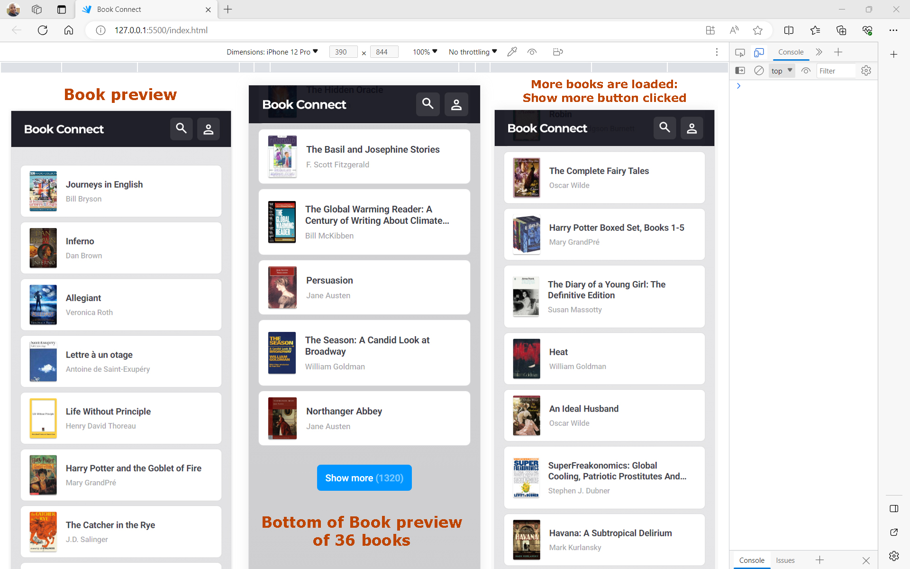
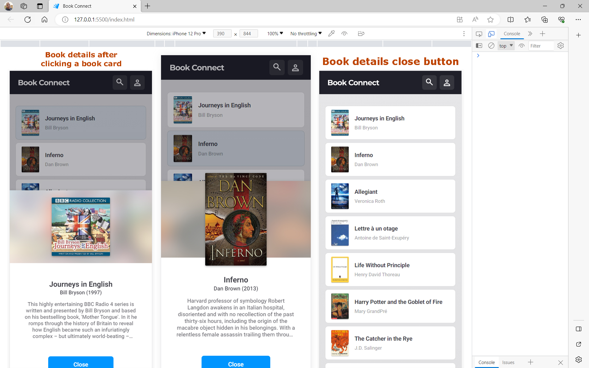
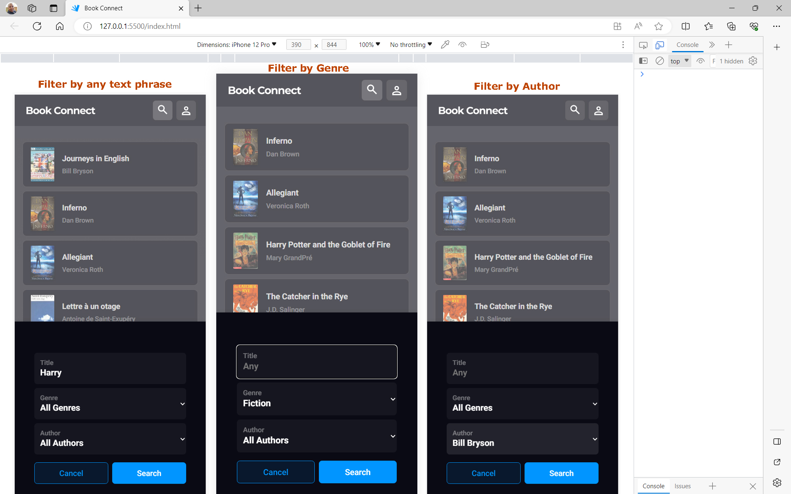
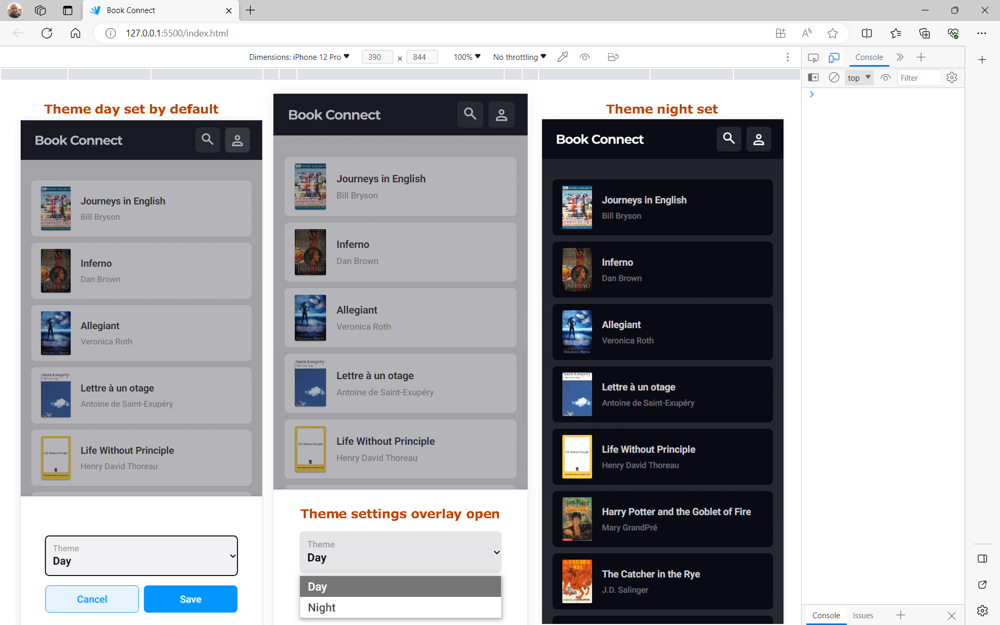

# MALLEG088_PTO2303_GroupB_MaleboLegodi_IWA19

## PTO2303 Group B:
Final Capstone Project IWA19 - An Interactive Web Application for a small business called Book Connect. Their App is for social media targeted at book enthusiasts.

## Problem statement:
Currently, the App throws several errors preventing the code from running. The goal is to do a full audit of the existing code and fix all critical issues by meeting all requirements of the prioritised user stories. The user stories express the product’s intended behaviour.

### Requirements(User stories):
Users should be able to scroll through the displayed list of book previews. Each book should display associated image, title, and author. Users should also be able to click on each book to view a summary of the book with the title, author, and published date. Using the search icon, users should be able to search for books by text phrases or author or genre. Lastly users should also be able to set theme mode between dark and light modes.

    * As a user, I want to view a list of book previews, by title and author, so that I can discover new books to read.
    * As a user, I want an image associated with all book previews so that I can recognize a book by the cover even if I forgot the name.
    * As a user, I want to have the option of reading a summary of the book so that I can decide whether I want to read it.
    * As a user, I want to have the option of seeing the date that a book was published so that I can determine how easy it is to obtain second-hand.
    * As a user, I want to find books based on specific text phrases so that I don’t need to remember the entire title of a book.
    * As a user, I want to filter books by author so that I can find books to read by authors that I enjoy.
    * As a user, I want to filter books by genre so that I can find books to read in genres that I enjoy.
    * As a user, I want to toggle between dark and light modes so that I can use the app comfortably at night.

[GitHub Repo](https://github.com/Malebo29/MALLEG088_PTO2303_GroupB_MaleboLegodi_IWA19/)

## Table of contents:
Description/Overview // GitHub Link // Technologies Used // Errors and Fixes // Code Snippets and Screenshots

## Technologies
The following languages, frameworks and APIs were used:
  * HTML
  * CSS
  * Javascript

## Code Snippets and Screenshots

When visiting this URL, the user is presented with a list of 36 book previews with the Day theme set by default. Using the ’Show more’ button at end of the 36 book previews, users can load more books. Each book is displayed with an associated image, title, and author.

Clicking on each book opens up its details in an overlay. On the overlay, users can see the title, author, and published date, and a summary of the book.

Clicking on the search icon opens up the Filter overlay. On the overlay, ‘All authors’ and ‘All genres’ are selected by default and users can use text phrases or a key search term to narrow their search for books. They can also select an author or genre from their respective filter fields to search for books by either an author or genre.

Clicking on the user (theme) icon opens up the Settings overlay with the Day theme selected by default. On the overlay, users can change the theme of the app between Night (dark) and Day (light) modes.

## Conclusion

`console.log()` was used to debug as I was coding along to make sense of the code presented to me. To get the data for each book, I turned the `data.js` into a module by adding exports statements to our data objects. I then created a new `view.js` that deals with anything related to the DOM and moved all the code associated with the DOM to `view.js`. I used the exports in our main `scripts.js` and `view.js` file as imports to make them available for use. I opted to use “for” loops to iterate through data, to create the book preview, present only the first 36 to the user on initial load with the Show more button to load more books showing number of remaining books.